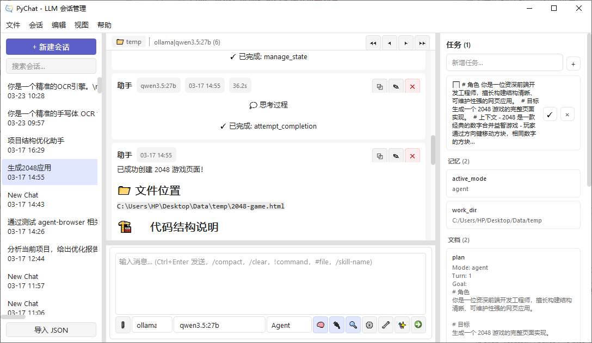
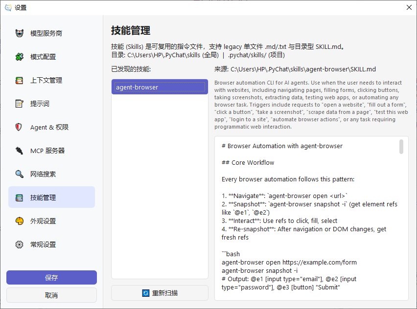

<div align="center">
   

   <h1>PyCat</h1>

   <p><strong>Native Python Desktop AI Workbench — Chat · Agent · Tools · Channels · MCP</strong></p>

   <p>English | <a href="./README_zh.md">简体中文</a></p>

   <p>
      PyCat is a <strong>pure-Python, native desktop AI workbench</strong> that unifies
      LLM chat, autonomous agents, tool orchestration, multi-platform IM channels, MCP,
      and skills — all in a single, Nuitka-compilable codebase.
   </p>

   <p>
      <a href="./ARCHITECTURE.md">Architecture</a> ·
      <a href="./docs/CC_HAHA_MIGRATION_NOTES.md">Migration Notes</a> ·
      <a href="./docs/releases/">Release Notes</a>
   </p>
</div>

<div align="center">
      
      
      
      
      
      
</div>

---

## 🧭 Why PyCat

Most AI desktop tools split their tech stack across 3–5 languages and frameworks — Electron for UI, TypeScript for logic, Rust/Tauri for performance, Bun for scripting. PyCat takes a **radically simpler approach**:

> **Everything in Python. One language. One runtime.**

| | Claude Code | Codex | Cherry Studio | Chatbox | **PyCat** |
|---|---|---|---|---|---|
| **GUI** | ❌ CLI only | ❌ CLI only | ✅ Electron | ✅ Electron | ✅ **Native PyQt6** |
| **Tech stack** | Rust + Shell + TS | Rust 96% | TS + Electron | TS + Electron | **Python (single)** |
| **Binary size** | ~200MB+ | ~200MB+ | ~200MB+ | ~200MB+ | **~70MB (Nuitka)** |
| **IM Channels** | — | — | **QQ / WeChat / Feishu / Telegram** | — | **QQ / WeChat / Feishu / Telegram** |
| **MCP / Skills** | ✅ | ✅ | ✅ | — | ✅ |
| **Native compile** | ❌ | ❌ | ❌ | ❌ | ✅ **Nuitka → .exe** |
| **Provider mgmt** | API key | ChatGPT plan | ✅ GUI | ✅ GUI | ✅ GUI |
| **Response formats** | Anthropic | OpenAI | OpenAI compat + Anthropic | OpenAI compat + Anthropic | OpenAI compat + Anthropic |

> ⚠️ **Early-stage disclaimer**: PyCat is still in early development. Feature depth, community size, and stability are nowhere near the mature projects above. This table only illustrates *technical approach differences*, not feature completeness. Cherry Studio has a richer extension ecosystem (MCP / skills / plugins / themes) and broader response format compatibility. Chatbox offers a more polished mobile experience. PyCat's core value is its **Python-only + Nuitka native compilation + built-in IM channels** approach — a different technical path, not a better one.

## ✨ Overview

PyCat is a native desktop AI workbench that brings LLM chat, multi-mode agents (Chat / Agent / Plan / Explore), tool orchestration, and **four mainstream IM channel integrations** into a single Python + PyQt6 application.

**Technical approach differences vs. alternatives:**

- 🐍 **Pure Python — no Electron, no TypeScript, no Rust, no Tauri.** One language, one `pip install`, simpler learning curve for extension and maintenance.
- ⚡ **Nuitka native compilation** — compiles to a standalone `.exe` (~80 MB), smaller than Electron bundles that ship an entire browser engine.
- 💬 **Multi-platform IM Channels** — QQ Bot, WeChat (QR bridge), Feishu (WebSocket), and Telegram (Bot API) all built-in. A distinguishing feature among AI desktop clients.
- 🧠 **Four agent modes** — Chat, Agent (autonomous), Plan (structured planning), and Explore (read-only codebase analysis).
- 🔌 **Dual API format** — supports both OpenAI API and Anthropic Messages natively.

> ⚠️ To be fair: Cherry Studio offers a more mature extension ecosystem (MCP, skills, plugins, themes) and broader response format compatibility. Chatbox has a more polished mobile experience. PyCat is still in early stages — if you need a production-ready desktop AI client today, Cherry Studio or Chatbox are more solid choices. If you're intrigued by the Python + Nuitka + IM channels approach, we'd love your help shaping it.

## 🖼️ Screenshots

<table>
   <tr>
      <td align="center" width="68%">
         
         <br />
         <sub><strong>Main window</strong>: conversation list, message flow, and task / memory / document panels in one workspace</sub>
      </td>
      <td align="center" width="32%">
         
         <br />
         <sub><strong>Settings</strong>: providers, modes, MCP, web search, and skills management</sub>
      </td>
   </tr>
</table>

## 🌟 Highlights

| Area | Description |
| --- | --- |
| **Chat / Agent / Plan / Explore** | Four distinct runtime modes in one desktop workflow — from casual chat to autonomous agents to structured planning to read-only code exploration. |
| **Four IM Channels** | QQ Bot (official Gateway), WeChat (QR bridge), Feishu (WebSocket), and Telegram (Bot API) — all built-in with auto-binding and replay. |
| **Multi-provider support** | OpenAI, Claude (Anthropic), Ollama, Google Gemini, DeepSeek, and more — with unified provider management UI. |
| **Dual API format** | Supports both OpenAI API (`/v1/chat/completions`) and Anthropic Messages API. |
| **Deep-thinking rendering** | Automatically parses and renders `<think>` / `<analysis>` / reasoning blocks with streaming-friendly display. |
| **Conversation & context** | Import / export, message editing, branch handling, image upload, multimodal interaction, and `reasoning`-aware history management. |
| **MCP / Skills / Tools** | MCP via `stdio`, reusable skills files, and a unified tool registry — all extensible from settings. |
| **Native desktop UX** | Dark / light themes, high-DPI support, conversation tree sidebar, Markdown rendering, and a clean information layout. |
| **Performance observability** | Real-time token throughput (Tokens/sec), response latency, and runtime timeline in the right inspection panel. |
| **Lightweight build** | Nuitka `--standalone` compilation produces a ~80 MB self-contained `.exe` — no Electron, no Node.js, no extra runtime. |
| **Clean architecture** | Layered `models → services → core → ui` with `ChannelRuntimeContext` as the sole facade for source backends. |

## 🧩 Feature Overview

### Multi-model & agent workflow

- Unified access to mainstream cloud and local models through a single provider management UI.
- Four built-in agent modes: **Chat** (conversational), **Agent** (autonomous tool-using), **Plan** (structured multi-step), and **Explore** (read-only codebase analysis).
- Conversation management optimized for desktop: tree sidebar, branch handling, import/export, and multimodal attachments.

### IM Channels (distinguishing feature)

- **QQ Bot**: Official Gateway WebSocket with AppID/AppSecret, auto Hello/Identify/Heartbeat/Dispatch, and automatic reply target binding.
- **WeChat**: QR-code bridge with transient-poll-timeout resilience — no need for a public webhook.
- **Feishu (Lark)**: WebSocket long-connection using a custom lightweight protobuf codec — no heavy `lark-oapi` SDK dependency.
- **Telegram**: Bot API long-polling (`getUpdates`) — just a Bot Token, no webhook required.
- All channels share a unified `ChannelRuntimeContext` boundary and auto-bind conversations to reply targets.

### Extensibility

- **MCP server configuration**: connect external tools or services through `stdio`.
- **Skills system**: reusable instruction files for capabilities such as browser automation, PR testing, and code review.
- **Mode configuration**: customize runtime modes, tool groups, permissions, and custom instructions per mode.
- **Native Python extensibility**: write tools, skills, and channel sources directly in Python — no IPC, no SDK bridge.

### Data and rendering

- Multiple conversation import formats: ChatGPT Export, OpenAI Payload, project backup JSON.
- Markdown, code syntax highlighting, Mermaid diagrams, and structured content.
- `assets/styles/` for UI theme customization.

### Observability & debugging

- Real-time token throughput and response latency in the right inspection panel.
- Tool timeline: `TOOL_START` / `TOOL_END` events with structured metadata.
- Stream debugging log toggle for diagnosing provider interactions.

## 🏗️ Architecture

The project follows a layered architecture for maintainability and future refactoring:

- **`ui/`**: presentation layer for windows, widgets, input collection, and interaction forwarding.
- **`core/`**: runtime core for command dispatching, task loops, prompt assembly, skills, attachments, and context building.
- **`services/`**: application services for persistence, provider management, search, and MCP orchestration.
- **`models/`**: data models such as Conversation, Provider, and State.
- **`utils/`**: general-purpose utilities with minimal business coupling.

See also:

- [`ARCHITECTURE.md`](./ARCHITECTURE.md)
- [`docs/PLAN_AGENT_RUNTIME_REFACTOR.md`](./docs/PLAN_AGENT_RUNTIME_REFACTOR.md)
- [`docs/ARCHITECTURE_REDESIGN.md`](./docs/ARCHITECTURE_REDESIGN.md)

## 🚀 Quick Start

### Requirements

- Python 3.9+
- Windows / macOS / Linux

### Install and run

```bash
git clone <repository-url>
cd pycat
python -m venv .venv

# Windows
.venv\Scripts\activate

# macOS / Linux
source .venv/bin/activate

pip install -r requirements.txt
python main.py
```

If you just want to try it quickly, the happy path is straightforward: install dependencies and run `python main.py`.

## 🛠️ Build for Windows (Nuitka)

To generate a standalone Windows build and a versioned zip package with Nuitka:

```powershell
python -m pip install -r requirements.txt
python -m pip install nuitka ordered-set zstandard
powershell -ExecutionPolicy Bypass -File .\build_nuitka.ps1
```

The build script will:

- compile a standalone Windows distribution with Nuitka (`--standalone --enable-plugin=pyqt6`),
- produce `pycat.exe` in the output directory,
- bundle `assets/`, `pycat.ico`, `LICENSE`, `README.md`, and `README_zh.md`,
- generate a versioned zip archive: `pycat-0.0.2-windows-x64.zip`.

> **Why Nuitka?** Unlike Electron-based apps that bundle an entire Chromium + Node.js runtime (~200 MB+), Nuitka compiles Python directly to native machine code, producing a self-contained ~80 MB package with no external runtime dependency. The result is faster startup, lower memory usage, and a genuinely portable executable.

## 📁 Project Structure

```text
pycat/
├─ assets/                 # icons, screenshots, style assets
├─ core/                   # runtime core logic
│  ├─ app/                 # AppState, coordinator, lightweight store
│  ├─ channel/             # channel protocol, runtime, sources/
│  │  └─ sources/          # platform implementations
│  │     ├─ feishu/        #   Feishu WebSocket + webhook
│  │     ├─ qqbot/         #   QQ Bot Gateway + OpenAPI
│  │     ├─ telegram/      #   Telegram Bot API polling
│  │     └─ wechat/        #   WeChat QR bridge + webhook
│  ├─ llm/                 # LLM client, request builder, config
│  ├─ modes/               # mode registry and defaults
│  ├─ prompts/             # system prompt assembly
│  ├─ runtime/             # TurnEngine, TurnPolicy, events
│  ├─ skills/              # skills system
│  ├─ state/               # conversation state services
│  ├─ task/                # multi-step task loops
│  └─ tools/               # MCP, system tools, tool registry
├─ docs/                   # design docs, migration notes, releases
│  └─ releases/            # versioned release notes
├─ models/                 # pure data models (no I/O)
├─ services/               # application services (persistence, providers, search)
├─ tests/                  # unit tests
├─ ui/                     # PyQt6 presentation layer
│  ├─ dialogs/             # modal dialogs
│  ├─ presenters/          # message / streaming / event presenters
│  ├─ runtime/             # Qt thread bridges
│  ├─ settings/            # settings pages
│  └─ widgets/             # reusable UI components
├─ build_nuitka.ps1        # Windows packaging script
├─ main.py                 # application entry point
└─ requirements.txt        # Python dependencies
```

## ⚙️ Notes

### MCP server configuration

You can add MCP servers from the settings page. PyCat communicates with MCP services through `stdio`, allowing web search, local file operations, and other external tools to be integrated into the conversation workflow.

### Conversation import

PyCat currently supports multiple import formats, including:

- **ChatGPT Export**: import official exported JSON bundles.
- **OpenAI Payload**: create conversations from API request payloads.
- **Conversation JSON**: project-specific backup format.

### Style customization

UI styles are mainly located in `assets/styles/`. If you want to move closer to a Cherry Studio-inspired look or build your own branded appearance, this is where the fun starts.

## 🤝 Contributing

PyCat is in early stages and iterating quickly. Contributions of all kinds are welcome — new features, bug fixes, documentation, UI polish, channel integrations, and testing.

**Current status:** v0.0.2, 145 unit tests passing, four channels with basic functionality, `lark-oapi` dependency removed.

> ⚠️ The project still has many rough edges: limited feature depth, no mobile support, small community, incomplete documentation. If you're looking for a production-ready tool, Cherry Studio or Chatbox are better choices today. If you're interested in the Python + Nuitka + IM channels approach, we'd love your help improving it.

**Good first contributions:**

- Add a new channel source (e.g., Slack, Discord, DingTalk) following the `core/channel/sources/<source>/` pattern.
- Polish the UI theme or add new `assets/styles/` variants.
- Extend the skills library with new reusable skill files.
- Improve test coverage for `core/channel/`, `core/runtime/`, or `ui/presenters/`.
- Write documentation or tutorials.

### Before you start:

1. Read `ARCHITECTURE.md` to understand the layering rules.
2. Follow the `models → services → core → ui` dependency direction.
3. When adding a channel, use `ChannelRuntimeContext` as the sole API boundary — never access runtime private state directly.
4. Run `python -m unittest discover -s tests` and `python -m compileall core ui models tests` before submitting.

**Iterating fast, and we'd love to have you on board.** 🚀

## 📜 License

PyCat is licensed under the GNU Affero General Public License v3.0 (AGPL-3.0).

Commercial use is permitted, provided that all AGPL-3.0 obligations are fully satisfied.

See [`LICENSE`](./LICENSE) for the full license text.

