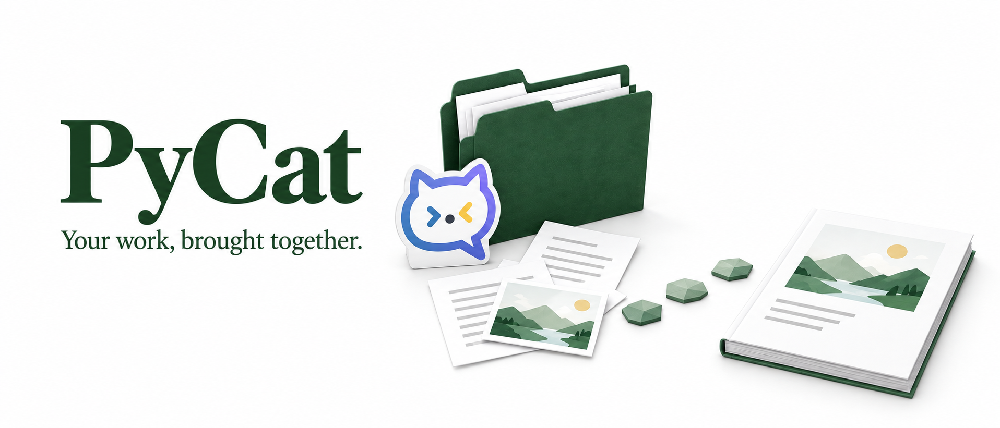
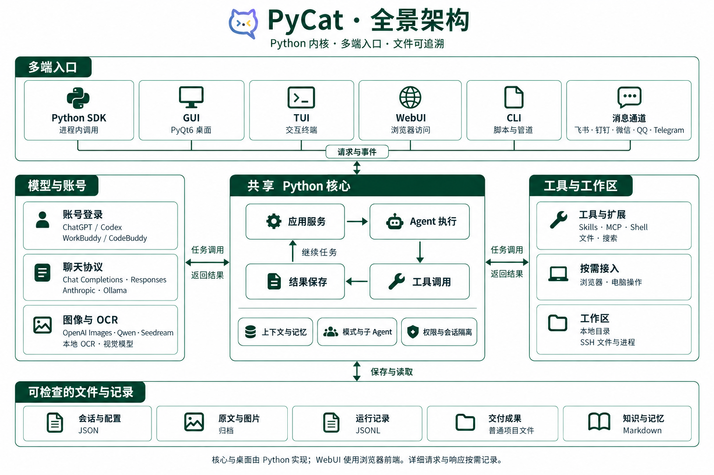
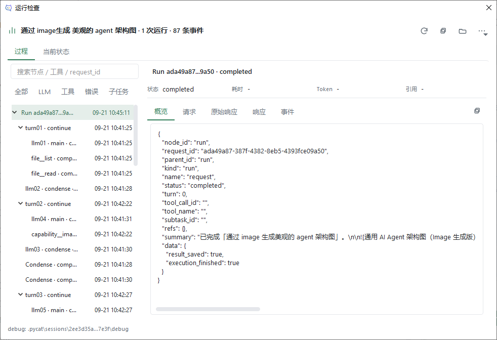
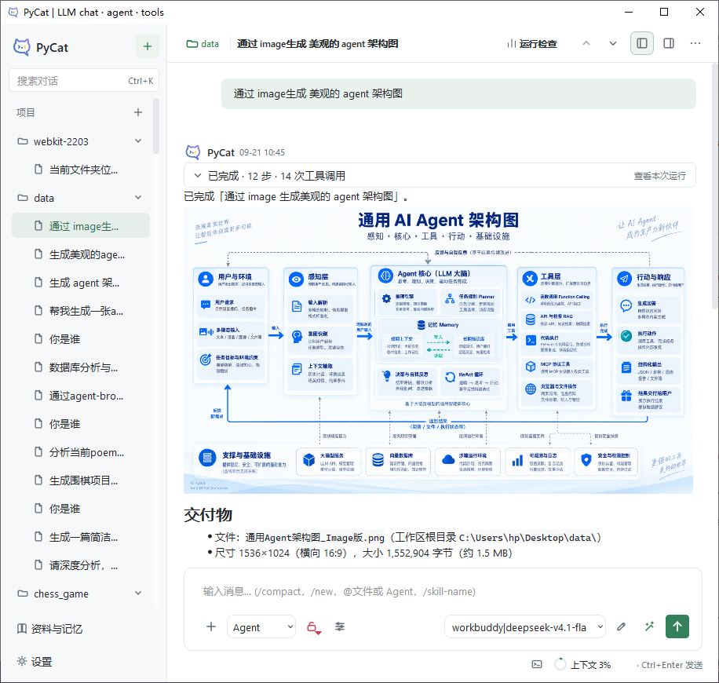
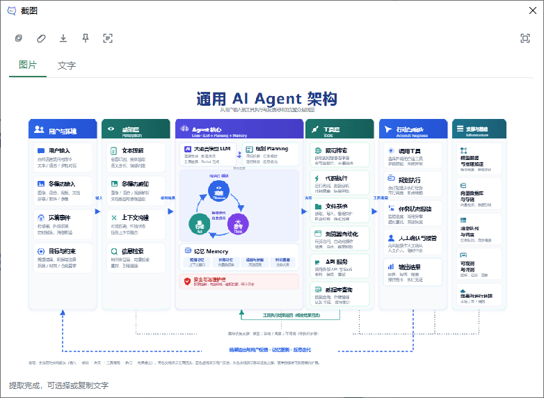
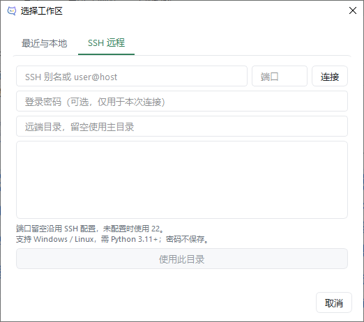
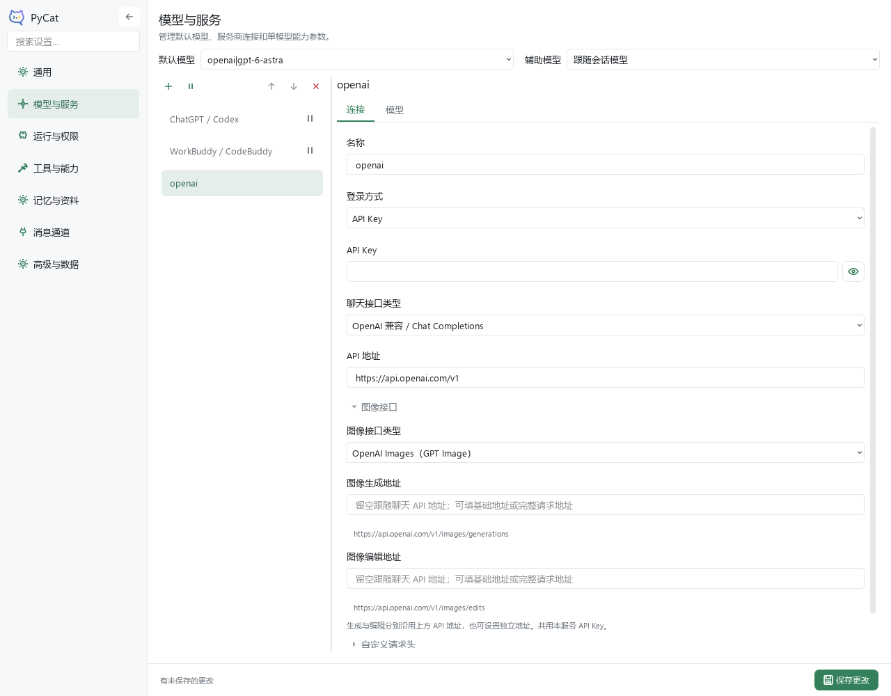
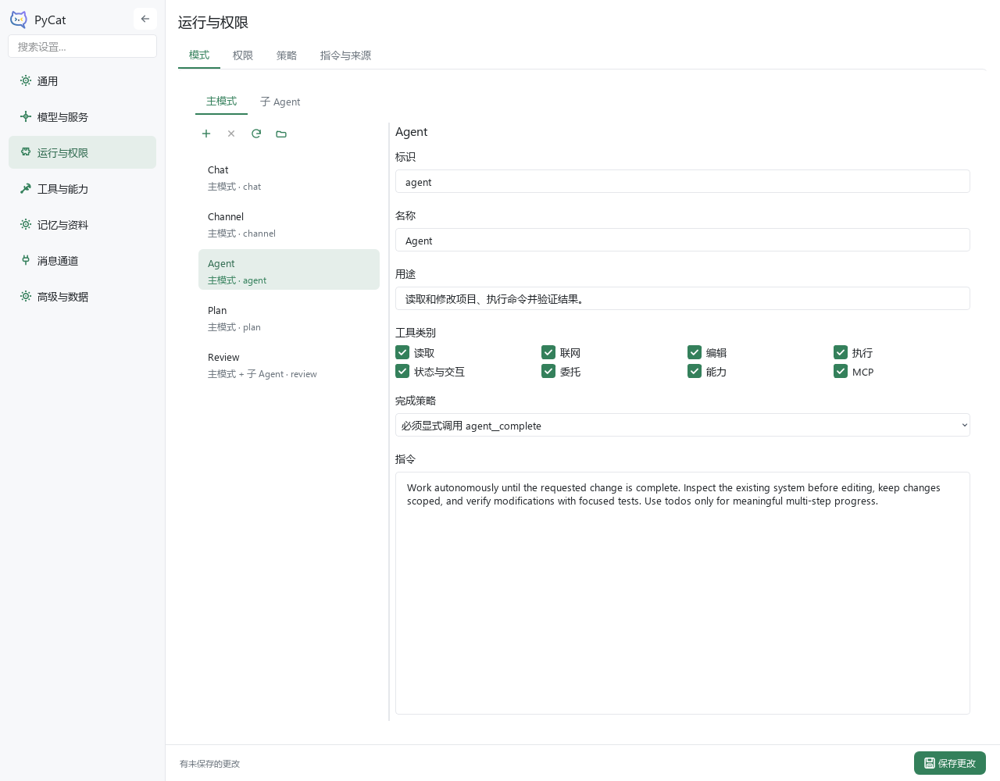
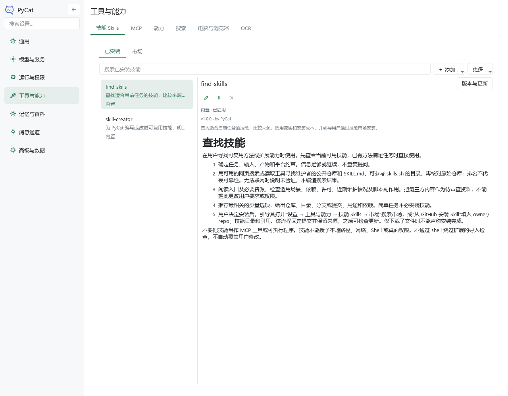
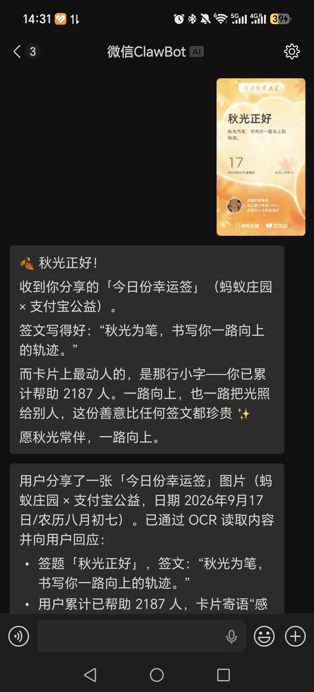

<div align="center">
  
  <h1>PyCat</h1>
  <p><strong>Python 原生 Agent 工作台 · 一个内核，五种入口，文件中的透明过程</strong></p>
  <p>用桌面完成工作，用 Python 接入自动化，让过程与成果留在自己的项目里。</p>
  <p>
    <a href="https://www.python.org/"></a>
    <a href="https://www.riverbankcomputing.com/software/pyqt/"></a>
    <a href="https://nuitka.net/"></a>
    <a href="https://github.com/nanhuayu/pycat/releases"></a>
    <a href="https://github.com/nanhuayu/pycat/stargazers"></a>
    <a href="LICENSE"></a>
  </p>
  <p>简体中文 · <a href="README_en.md">English</a> · <a href="https://github.com/nanhuayu/pycat/releases">下载</a> · <a href="docs/product/user-guide_zh.md">使用指南</a> · <a href="docs/product/developers_zh.md">开发者使用</a></p>
</div>

**Py = Python，CAT = Chat · Agent · Tools。** 对话理解目标，Agent 推进任务，工具连接真实的文件、程序和服务；猫形标志也表达了这个项目希望成为日常工作伙伴的想法。

PyCat 面向开发者、自动化实践者和处理真实项目的进阶用户。它把 **Python SDK、GUI、TUI、WebUI、CLI** 连接到同一套 Agent 执行能力：从本地或 SSH 项目出发，分析代码、运行命令、整理资料、生成图片，并检查每一步发生了什么。

- **Python 核心，直接调用**：应用核心、SDK 与原生桌面以 Python 实现，便于嵌入脚本、调试和修改。
- **多种入口，共享能力**：桌面操作、终端任务、浏览器访问和消息机器人复用执行、工具与权限规则。
- **已有账号，直接登录**：支持 ChatGPT / Codex 与 WorkBuddy / CodeBuddy 账号接入，也可使用 API Key 或本地模型服务，在同一工作台选择适合任务的模型。
- **文件保存，可检查可接续**：会话、输入快照、工具原文、运行记录和交付文件保存在本地，便于检索、备份、追溯和继续加工。



*产品场景插画；实际界面与运行案例见下方功能介绍。*

## 快速开始

**直接使用桌面版**

1. 从 [Releases](https://github.com/nanhuayu/pycat/releases) 下载 Windows 便携包，完整解压，在 `pycat-windows-x64` 中运行 **`pycat.exe`**。
2. 在 **设置 → 模型与服务** 配置模型连接，选择一个项目文件夹。
3. 描述目标，检查执行过程和生成的文件，再继续提出修改要求。

PyCat 不附带模型额度。当前桌面默认允许自动执行和访问所有本地路径，可在输入区的权限菜单中收窄范围或改为逐次确认。具体操作见[使用指南](docs/product/user-guide_zh.md)。

**从 Python 或终端开始**

在克隆后的源码目录中，使用 Python 3.11+ 安装：

```shell
git clone https://github.com/nanhuayu/pycat.git
cd pycat
python -m pip install .                 # SDK + CLI
python -m pip install ".[gui,tui,web]"   # 按需增加桌面、TUI 和 WebUI

# 配置模型后
pycat exec "分析当前项目，给出重构计划" -C . --mode plan --output-format json
pycat resume --last
```

基础 SDK 无需 Qt、Textual、FastAPI 或本地 OCR。完整的模型配置和可运行 SDK 示例见[开发者使用指南](docs/product/developers_zh.md)。

## 使用现有账号，也能连接自己的模型服务

在 **设置 → 模型与服务 → 登录方式** 选择接入方式。账号登录在浏览器中完成授权，返回 PyCat 后选择可用模型；无需先启动 Codex 或 CodeBuddy CLI 进程。

| 接入方式 | 可以怎样使用 |
| --- | --- |
| **ChatGPT / Codex 登录** | 登录已有 ChatGPT 账号，通过账号连接使用其有权限访问的模型 |
| **WorkBuddy / CodeBuddy 登录** | 登录国内 WorkBuddy / CodeBuddy 账号，使用账号提供的可用模型 |
| **API Key / 本地服务** | 自行配置服务地址、接口协议和模型，连接云端 API 或已部署的 Ollama 等本地服务 |

账号登录与 API Key 是不同的接入方式，额度与可用模型由相应服务决定；PyCat 不附送额度，也不保证订阅包含全部模型。账号集成目前属于实验性功能，可能随上游服务变化。操作步骤见[使用指南](docs/product/user-guide_zh.md#1-安装与连接模型)。

## Python 带来的实际价值

PyCat 将 Agent 编排、工具、模型适配、应用服务和桌面交互放在 Python 代码体系中。对已有 Python 工程的开发者，模型能力可以成为自己的程序的一部分。

| 你要做的事 | PyCat 提供的方式 | 实际价值 |
| --- | --- | --- |
| 把 Agent 嵌入已有程序 | `from pycat import PyCat, RunRequest`，在进程内调用 | 复用 Python 对象、异常处理与调试工具，无需先启动桌面或另建 HTTP 桥接 |
| 改模型策略、工具或执行行为 | 修改 Python 核心，通过 SDK / CLI 验证 | 在同一语言中阅读、实验和检查行为变化 |
| 增加截图、剪贴板、托盘等交互 | Python + PyQt6 原生组件 | 直接接入桌面能力；桌面终端与内容预览无需 WebEngine |
| 从手动操作走向批量自动化 | GUI 验证工作方式，SDK / CLI 驱动任务 | 多个入口复用 Agent 内核、工具边界和配置契约 |
| 交付给不安装 Python 的使用者 | Nuitka 构建独立 Windows 发行包 | 解压运行，桌面包无需 Electron、Node.js 或浏览器内核 |

**这里的“Python 原生”指核心与桌面实现。** 可选 WebUI 包含 HTML / CSS / JavaScript，Qt、OCR 等依赖也包含原生代码；部分外部 MCP 服务可能需要 Node.js。这个选择减少了核心与桌面的跨语言维护面，实际速度、内存和包体积仍取决于功能与依赖。

## 一个内核，五种入口

| 入口 | 适合的工作 | 使用方式 |
| --- | --- | --- |
| **SDK** | 嵌入 Python 应用、批处理、评估实验 | 异步调用，读取事件与结果，取消任务、继续会话 |
| **GUI** | 日常项目操作、设置、图片和运行检查 | 原生 PyQt6；源码安装后运行 `pycat-gui` |
| **TUI** | 在交互终端中持续工作 | 安装 `tui` 后运行 `pycat` |
| **WebUI** | 从浏览器访问运行中的 PyCat 宿主 | 安装 `web` 后运行 `pycat serve` |
| **CLI** | 自动化脚本、管道、计划任务 | `pycat exec` / `resume`，支持 JSON 和逐行事件输出 |

此外，飞书 / Lark、钉钉、Telegram、QQ 和微信也可以作为任务入口。不同界面围绕各自场景提供操作，并非每个界面都具有相同的设置控件。

Python、Qt 和终端生态便于持续完善跨平台体验；**当前提供 Windows 便携包，SSH 远端支持 Windows / Linux**。其他系统的源码运行仍需按平台安装依赖、验证系统能力，不将“多入口”当作所有系统均已验收的承诺。Web 宿主与桌面各自管理自己的数据目录，不支持并发写同一个目录。

## 全景架构



*按当前实现整理的功能关系概览。多种入口复用同一套核心代码，独立运行的应用仍各自管理数据目录；箭头表示调用与数据往返，不表示每次任务固定经过所有模块。*

## 让过程与结果成为可检查的文件

**文件是 PyCat 保存工作成果和运行证据的基本载体。** 对话结束后，可以继续用编辑器、文件管理器、脚本或版本管理工具处理这些材料。

| 内容 | 保存形式 | 可以怎样使用 |
| --- | --- | --- |
| 会话与配置 | 本地 JSON | 查看、导出和备份；继续已有会话 |
| 输入与工具结果 | 会话目录中的输入快照、原文与图片归档 | 对照来源，读取完整工具输出，检查摘要之外的内容 |
| 运行过程 | JSONL 事件及可选请求 / 响应附件 | 在“运行检查”中定位步骤，也可用脚本分析 |
| 交付成果与知识 | 普通项目文件、Markdown 知识页和记忆文件 | 搜索、比较、编辑、归档或用于后续任务 |

本地项目的大体积会话资料集中在 `.pycat/sessions/<会话 ID>/`。原文归档与压缩摘要分开保存，界面展示和模型上下文可以精简，同时保留已归档的来源。

默认记录轻量运行事件；需要完整请求 / 响应诊断时开启详细日志。运行记录可帮助解释行为，但不等于完整机器快照或一键重放所有外部操作。数据位置、SQLite 索引和备份范围见[开发者指南](docs/product/developers_zh.md#文件数据与可检查的运行)。



## 面向真实项目的能力

| 能力 | 当前支持 |
| --- | --- |
| **多模型协议** | OpenAI Chat Completions / Responses、Anthropic Messages、Ollama |
| **图像生成与编辑** | OpenAI Images、Qwen DashScope、Seedream Ark；生成与编辑地址独立配置 |
| **模式与子 Agent** | Chat、Agent、Plan、Review；可配置模型、指令、工具类别与委派范围 |
| **Skills 与 MCP** | 管理、发现与更新入口；内置 find-skills / skill-creator；MCP stdio、SSE、Streamable HTTP |
| **交互 Shell** | 新建 Shell、查看状态、继续输入、接管和结束进程 |
| **图片与 OCR** | 截图识别、本地 OCR 或视觉模型 OCR、SVG / 图片预览、Markdown 内嵌图片 |
| **本地与远程** | 本地工作区、SSH 文件与进程操作、独立 Web 宿主 |
| **资料与记忆** | 项目成果、知识页、可复用记忆与偏好 |

### 图像生成与交付

生成图片直接显示在 Markdown 对话正文中，交付文件可以继续预览、编辑或用于项目。



*使用者提供的实际任务截图。图中的通用 Agent 架构图是该次任务产出，并非上方的 PyCat 全景架构图。*

### 截图识别

截取内容后，可以在图片与文字视图间切换，选择或复制识别结果；OCR 也可单独指定视觉模型和提示词。



### SSH 项目

连接远端项目，在熟悉的本地界面中操作远端文件与进程。远端需 SSH 和 Python 3.11+，无需安装完整 PyCat。



### 在设置中定义工作方式

**模型与服务**：聊天协议和图像接口分别配置；模型用途、推理参数与专用能力可以独立选择。



**运行与权限**：配置主模式、子 Agent、工具类别、指令和完成方式。



**工具与能力**：管理 Skills、MCP、模型能力、搜索、电脑与浏览器和 OCR。



### 从消息平台发起任务

配置机器人并绑定项目后，可以在 **飞书 / Lark、钉钉、Telegram、QQ 或微信** 中发起任务，传入平台支持的图片与文件，并接收明确交付的成果。



PyCat 所在电脑需要保持运行并联网，各平台的附件和权限限制不同。上图展示使用者提供的微信机器人交互案例，机器人名称为聊天显示名称。

*本页生图、截图识别、SSH、运行检查与微信图片来自使用者选定的实际界面；设置截图使用隔离示例配置。截图说明具体操作，模型输出和 OCR 内容仍需复核。*

## 技术路线如何取舍

选择工具时，可以先比较自己的集成需求，而不是只比较功能数量：

| 关注点 | 需要权衡什么 | PyCat 的选择 |
| --- | --- | --- |
| **已有 Python 工程** | 使用远程 API、跨进程接口，还是进程内 SDK | 提供进程内 Python SDK，也保留 CLI 与 Web 接口 |
| **原生桌面与网页体验** | 系统集成、网页复用和各端维护成本 | PyQt6 桌面与可选 WebUI 分开适配，共用 Python 核心 |
| **数据可检查性** | 如何取得会话、工具原文和交付结果 | 以本地文件保存主要业务内容，提供运行检查和结构化输出 |
| **定制与迭代** | 能否修改策略，并用自己的任务集验证 | Python 源码、模型与模式配置、Skills / MCP 扩展 |
| **部署与维护** | 需要哪些运行环境、依赖和系统验证 | SDK 按需安装，Windows 发行包包含已选择的界面与本地 OCR |

不同语言与 UI 框架有各自适合的场景。PyCat 的优势在于 **Python 工程中的直接集成、统一执行能力和透明的文件工作流**；不以未经同条件测试的体积、速度或成功率作为对比结论。

## 适合持续迭代的 Agent 基础

可以用 SDK 固定任务集和预算，比较不同模型、模式、技能或代码候选，再从文件结果与运行记录中分析差异。Python 源码便于 Agent 读取、修改、运行和检查，原生桌面便于人参与验收。

这让 PyCat 适合作为 **Agent 自改进与 RSI 研究的工程基础**。当前可用的是执行、扩展、记录与评估接入能力；候选管理、独立评估、自动选择、发布和回滚组成的完整自主进化闭环仍需自行搭建。详见[开发者使用指南](docs/product/developers_zh.md)。

## 参与 PyCat

欢迎贡献真实任务示例、模型协议适配、技能、MCP 接入、跨平台修复和原生桌面改进。报告问题时，请提供版本、复现步骤、期望结果和脱敏材料。

如果 Python 原生、多入口和透明文件工作流对你有帮助，欢迎 **Star**、试用并分享可以复现的反馈。可在 [Star History](https://www.star-history.com/#nanhuayu/pycat&Date) 查看项目的关注趋势。

[反馈问题](https://github.com/nanhuayu/pycat/issues) · [参与改进](https://github.com/nanhuayu/pycat/pulls) · [开发者使用](docs/product/developers_zh.md) · [使用指南](docs/product/user-guide_zh.md)

PyCat 采用 [AGPL-3.0-only](LICENSE) 许可证。项目与会话保存在本地；使用云端模型、联网工具或消息平台时，相关内容会发送到所配置的服务。
