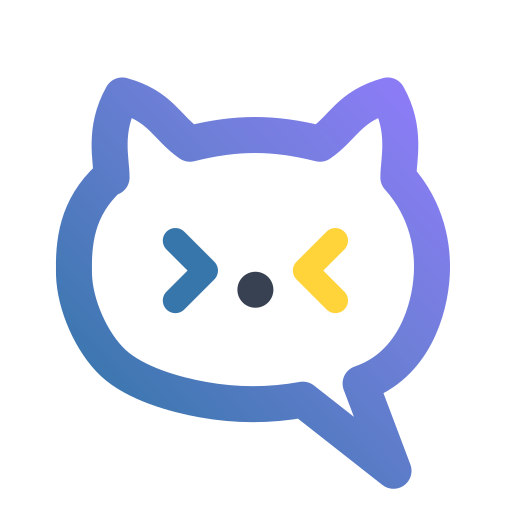
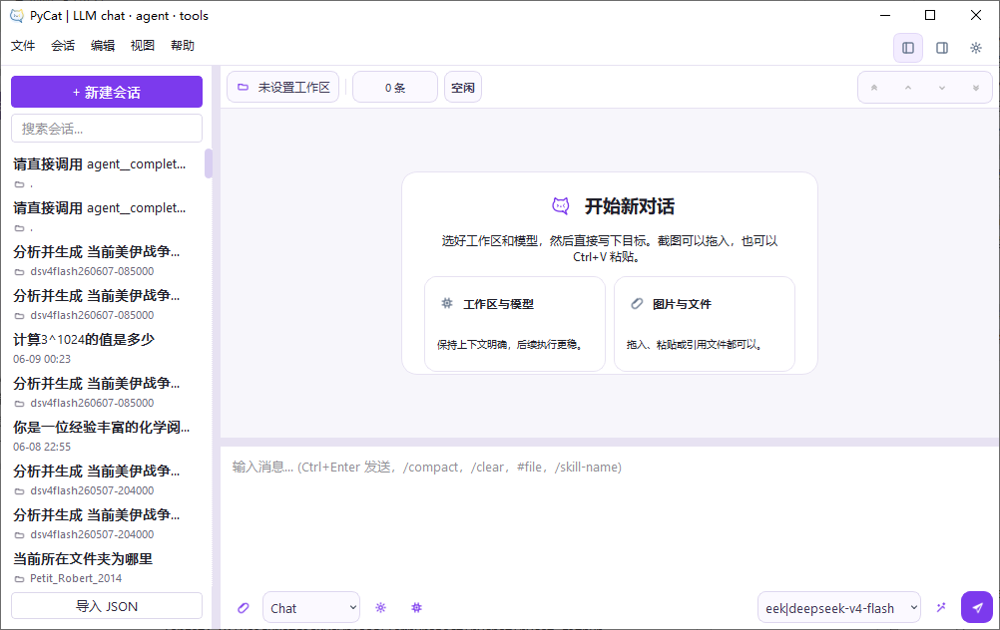
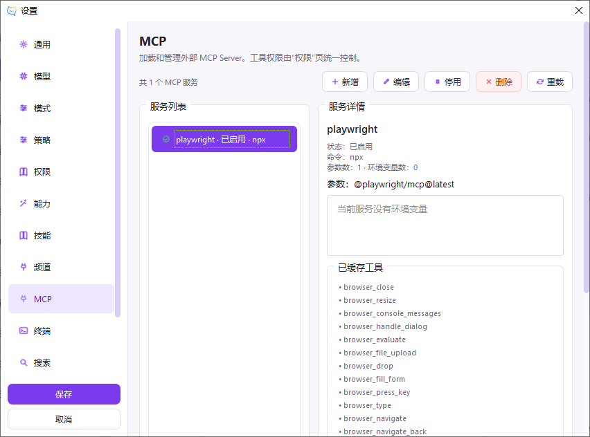

<div align="center">
   

   <h1>PyCat</h1>

   <p><strong>原生 Python 桌面 AI 工作台 — Chat · Agent · Tools · Channels · MCP</strong></p>

   <p><a href="./README.md">English</a> | 简体中文</p>

   <p>
      PyCat 是一款<strong>纯 Python 原生桌面 AI 工作台</strong>，将 LLM 聊天、自主智能体、工具编排、
      四大主流 IM 频道接入、MCP 协议与技能系统整合进同一个 Nuitka 可编译的代码库。
   </p>

   <p>
      <a href="./docs/README.md">文档导航</a> ·
      <a href="./docs/architecture/">架构说明</a> ·
      <a href="./docs/architecture/modules.md">代码地图</a> ·
      <a href="./docs/releases/">发布说明</a>
   </p>
</div>

<div align="center">
   
   
   
   
   
   
</div>

---

## 🧭 为什么选择 PyCat

市面上的 AI 桌面工具大多将技术栈分散在 3–5 种语言和框架之间——Electron 做 UI、TypeScript 做逻辑、Rust/Tauri 做性能、Bun 做脚本。PyCat 选择了**一条极简路径**：

> **全部用 Python。一种语言。一个运行时。**

| | Claude Code | Codex | Cherry Studio | Chatbox | **PyCat** |
|---|---|---|---|---|---|
| **图形界面** | ❌ 纯 CLI | ❌ 纯 CLI | ✅ Electron | ✅ Electron | ✅ **原生 PyQt6** |
| **技术栈** | Rust + Shell + TS | Rust 96% | TS + Electron | TS + Electron | **Python（单一语言）** |
| **安装包大小** | ~200MB+ | ~200MB+ | ~200MB+ | ~200MB+ | **~70MB（Nuitka）** |
| **IM 频道** | — | — | **QQ / 微信 / 飞书 / Telegram** | — | **QQ / 微信 / 飞书 / Telegram** |
| **MCP / Skills** | ✅ | ✅ | ✅ | — | ✅ |
| **原生编译** | ❌ | ❌ | ❌ | ❌ | ✅ **Nuitka → .exe** |
| **服务商管理** | API key | ChatGPT 计划 | ✅ GUI | ✅ GUI | ✅ GUI |
| **响应格式** | Anthropic | OpenAI | OpenAI 兼容 + Anthropic | OpenAI 兼容 + Anthropic | OpenAI 兼容 + Anthropic |

> ⚠️ **项目早期声明**：PyCat 仍处于早期阶段，功能深度和社区规模远不及上述成熟项目。上表仅展示技术路线差异，并非功能完备性对比。Cherry Studio 在可扩展性、响应格式覆盖面上更成熟，Chatbox 在移动端体验上更完善。PyCat 的核心价值在于 **Python 单语言 + Nuitka 原生编译 + 内置 IM 频道** 这条不同的技术路径。

## ✨ 项目简介

PyCat 是一款面向桌面场景的原生 AI 工作台，将 LLM 聊天、多模式智能体（Chat / Agent / Plan / Explore）、工具调用与**四大主流 IM 频道**整合进同一个 Python + PyQt6 应用。

**与同类产品相比的技术路线差异：**

- 🐍 **纯 Python — 没有 Electron、没有 TypeScript、没有 Rust、没有 Tauri。** 一种语言，一条 `pip install`，上手和维护的学习成本更低。
- ⚡ **Nuitka 原生编译** — 编译为独立 `.exe`（~80 MB），比 Electron 应用体积更小，无需捆绑浏览器内核。
- 💬 **多平台 IM 频道接入** — QQ Bot、微信（二维码桥接）、飞书（WebSocket）、Telegram（Bot API），全部内置。这是 PyCat 区别于其他桌面 AI 客户端的特点之一。
- 🧠 **四种 Agent 模式** — Chat（对话）、Agent（自主执行）、Plan（结构化规划）、Explore（只读代码分析）。
- 🔌 **双 API 格式原生支持** — 同时支持 OpenAI API 和 Anthropic Messages，不只是 OpenAI 兼容层。

> ⚠️ 需要诚实地指出：Cherry Studio 在可扩展性（MCP / 技能 / 插件 / 主题生态）、响应格式兼容性、社区规模方面更加成熟；Chatbox 拥有更完善的移动端体验。PyCat 当前仍处于早期阶段，功能深度和稳定性还在持续完善中。如果你需要一个成熟稳定的桌面 AI 客户端，Cherry Studio 或 Chatbox 是目前更稳妥的选择。如果你对 Python 技术栈、Nuitka 原生编译、内置 IM 频道这些技术方向感兴趣，欢迎一起来打磨 PyCat。

### 适合谁用：

- 对 Python 技术栈感兴趣、想在一个纯 Python 项目中定制和扩展的开发者。
- 需要 IM 频道机器人的同时还需要桌面 AI 工作台的场景。
- 偏好原生桌面性能、对包体积有要求的用户。
- 想参与一个架构清晰、迭代迅速的早期开源项目的贡献者。

## 🖼️ 界面预览

<table>
   <tr>
      <td align="center" width="68%">
         
         <br />
         <sub><strong>主界面</strong>：会话列表、消息流、任务 / 记忆 / 文档面板集中展示</sub>
      </td>
      <td align="center" width="32%">
         
         <br />
         <sub><strong>设置中心</strong>：模型服务商、模式配置、MCP、网络搜索、技能管理</sub>
      </td>
   </tr>
</table>

## 🌟 核心亮点

| 模块 | 说明 |
| --- | --- |
| **Chat / Agent / Plan / Explore** | 四种独立运行模式整合在同一个桌面工作流中——从日常聊天到自主 Agent 到结构化规划到只读代码探索。 |
| **四大 IM 频道** | QQ Bot（官方 Gateway）、微信（二维码桥接）、飞书（WebSocket）、Telegram（Bot API）——全内置，自动绑定回发目标。 |
| **多模型供应商** | OpenAI、Claude（Anthropic）、Ollama、Google Gemini、DeepSeek 等多种 API / 协议接入，统一管理界面。 |
| **双 API 格式** | 同时支持 OpenAI API（`/v1/chat/completions`）与 Anthropic Messages API。 |
| **深度思考渲染** | 自动解析并渲染 `<think>` / `<analysis>` / reasoning 块，支持流式展示思考过程。 |
| **对话与上下文** | 导入 / 导出、消息编辑、分支管理、图片上传、多模态交互、reasoning 感知的历史管理。 |
| **MCP / Skills / Tools** | MCP 通过 `stdio` 接入，可复用技能文件，统一工具注册——全部在设置中可配置。 |
| **原生桌面体验** | 暗色 / 亮色主题、高 DPI 支持、会话树侧边栏、Markdown 渲染、清晰的信息布局。 |
| **性能可观测** | 实时 Token 消耗速度（Tokens/sec）、响应延迟、右侧检查面板的运行时间线。 |
| **轻量构建** | Nuitka `--standalone` 编译生成 ~80 MB 自包含 `.exe`——不需要 Electron、不需要 Node.js、不需要额外运行时。 |
| **清晰架构** | 分层的契约、core 领域、应用服务与适配器，以 `ChannelGateway`/`ChannelService` 作为频道应用边界。 |

## 🧩 功能概览

### 多模型与 Agent 工作流

- 通过统一的服务商管理界面接入主流云端与本地模型。
- 四种内置 Agent 模式：**Chat**（对话）、**Agent**（自主工具调用）、**Plan**（结构化多步规划）、**Explore**（只读代码分析）。
- 桌面端优化的会话管理：树形侧边栏、分支管理、导入 / 导出、多模态附件。

### IM 频道（PyCat 的特色功能）

- **QQ Bot**：官方 Gateway WebSocket，AppID/AppSecret 接入，自动 Hello/Identify/Heartbeat/Dispatch 与回发目标绑定。
- **微信**：二维码桥接，支持长轮询超时降噪——无需公网回调。
- **飞书**：WebSocket 长连接，使用自定义轻量 protobuf codec——不依赖 `lark-oapi` 重型 SDK。
- **Telegram**：Bot API 长轮询（`getUpdates`）——只需 Bot Token，无需 webhook。
- 所有频道共享统一的 `ChannelGateway`/`ChannelService` 边界，并自动绑定会话到回发目标。

### 扩展能力

- **MCP 服务器配置**：通过 `stdio` 方式连接外部工具或服务。
- **技能系统（Skills）**：可复用的指令文件，支持浏览器自动化、PR 测试、代码审查等能力。
- **模式配置**：按模式自定义运行策略、工具组、权限和自定义指令。
- **原生 Python 扩展性**：直接用 Python 编写工具、技能和频道 source——无需 IPC、无需 SDK 桥接。

### 数据与展示

- 多种对话导入格式：ChatGPT Export、OpenAI Payload、项目自定义备份。
- Markdown、代码语法高亮、Mermaid 图表与结构化内容。
- `assets/styles/` 用于 UI 主题自定义。

### 可观测性与调试

- 右侧检查面板实时显示 Token 消耗速度与响应延迟。
- 工具时间线：`TOOL_START` / `TOOL_END` 事件含结构化元数据。
- 流式调试日志开关，便于诊断服务商交互。

## 🏗️ 架构设计

项目采用分层架构，便于维护与后续重构：

- **`gui/`**：纯表现层，负责窗口、组件、输入状态采集与交互转发。
- **`core/`**：领域核心，负责 Agent 编排、上下文、内容、工具、技能、频道、能力与 LLM 集成。
- **`core/app/`**：组合根、repository 与应用服务，负责持久化、Provider、会话、上下文和搜索。
- **`models/`**：纯数据模型与跨层 contracts，保存 Conversation、Provider、RunPolicy、SessionState 等结构。

更多说明请参考：

- [`docs/README.md`](./docs/README.md)
- [`docs/architecture/`](./docs/architecture/)
- [`docs/architecture/modules.md`](./docs/architecture/modules.md) 与 [`docs/architecture/concepts.md`](./docs/architecture/concepts.md)
- [`docs/STATUS.md`](./docs/STATUS.md)
- [`AGENTS.md`](./AGENTS.md) 与 [`CONTRIBUTING.md`](./CONTRIBUTING.md)
- [`docs/product/`](./docs/product/) 与 [`docs/engineering/`](./docs/engineering/)

## 🚀 快速开始

### 环境要求

- Python 3.9+
- Windows / macOS / Linux

### 安装与运行

```bash
git clone <repository-url>
cd pycat
python -m venv .venv

# Windows
.venv\Scripts\activate

# macOS / Linux
source .venv/bin/activate

pip install -r requirements.txt
python main.py
```

如果你只是想尽快体验，核心启动路径非常直接：安装依赖，然后执行 `python main.py` 即可。没有花里胡哨，主打一个马上开聊。

## 🛠️ Windows 打包（Nuitka）

如果你希望生成基于 Nuitka 的 Windows 独立运行包与版本化 zip 压缩包，可执行：

```powershell
python -m pip install -r requirements.txt
python -m pip install nuitka ordered-set zstandard
powershell -ExecutionPolicy Bypass -File .\build_nuitka.ps1
```

该脚本会自动：

- 使用 Nuitka 生成 Windows 独立运行目录（`--standalone --enable-plugin=pyqt6`），
- 生成 `pycat.exe` 到输出目录，
- 打包 `assets/`、`pycat.ico`、`LICENSE`、`README.md` 与 `README_zh.md`，
- 在项目根目录生成使用打包脚本版本字段的压缩包。

> **为什么用 Nuitka？** 与 Electron 系应用需要捆绑整个 Chromium + Node.js 运行时（~200MB+）不同，Nuitka 将 Python 代码直接编译为原生机器码，生成自包含的 ~80MB 包，无需外部运行时依赖。结果是更快的启动、更低的内存占用和真正可移植的可执行文件。

## 📁 目录速览

```text
pycat/
├─ assets/                 # 图标、截图、样式资源
├─ core/                   # 领域核心与应用组合
│  ├─ agent/               # AgentRuntime、run engine、request pipeline、subagent、events
│  ├─ app/                 # AppContainer、repositories、应用服务、coordinator
│  ├─ capabilities/        # capability 默认值、merge、executor、tool adapter
│  ├─ channel/             # gateway、lifecycle、scheduler、platforms、reply
│  ├─ content/             # archive store、content view、markdown、attachments
│  ├─ context/             # context sections、providers、maintenance、request replay
│  ├─ llm/                 # transport client、request payload、response parsing、token budget
│  ├─ memory/              # 长期短事实与 memory prompt input
│  ├─ modes/               # 模式注册与默认值
│  ├─ prompts/             # system prompt 与 provider message rendering
│  ├─ skills/              # discovery、manifest、routing、resources、prompt section
│  ├─ state/               # todo、artifact、work trace 会话状态操作
│  └─ tools/               # MCP、系统工具、catalog、permissions、execution adapters
├─ docs/                   # 产品、架构、状态、决策与证据
│  ├─ architecture/        # 当前系统与机制文档
│  ├─ product/             # 产品概览与用户工作流
│  ├─ engineering/         # 测试与文档治理
│  ├─ decisions/           # 已采纳架构决策
│  ├─ reference/           # 外部实现证据
│  ├─ archive/             # 唯一过期内部证据
│  └─ releases/            # 版本化发布说明
├─ models/                 # 纯数据模型与 models/contracts
├─ tests/                  # unit/runtime/channels/gui/cli 测试套件
├─ gui/                    # PyQt6 表现层
│  ├─ dialogs/             # 模态对话框
│  ├─ presenters/          # 消息 / 流式 / 事件 presenter
│  ├─ runtime/             # Qt 线程桥接
│  ├─ settings/            # 设置页面
│  └─ widgets/             # 可复用 GUI 组件
├─ build_nuitka.ps1        # Windows 打包脚本
├─ main.py                 # 应用入口
└─ requirements.txt        # Python 依赖
```

## ⚙️ 重点说明

### MCP 服务器配置

你可以在设置中添加 MCP 服务器。PyCat 支持通过 `stdio` 与 MCP 服务通信，从而把网络搜索、本地文件操作、外部工具调用等能力接入到对话流程中。

### 对话导入

当前支持多种历史记录导入形式，包括：

- **ChatGPT Export**：导入官方导出的 JSON 数据包。
- **OpenAI Payload**：基于 API 请求载荷生成对话。
- **Conversation JSON**：项目自定义备份格式。

### 样式定制

界面样式资源主要位于 `assets/styles/`。如果你希望继续向 Cherry Studio 风格靠拢，或者做出自己的品牌化外观，这里就是你的主战场。

## 🤝 贡献指南

PyCat 目前处于早期阶段，还在快速迭代中。欢迎各种形式的贡献——新功能、Bug 修复、文档、UI 打磨、频道接入和测试。

**当前状态：** 开发版本；版本号和测试结果以当前 checkout 的源码与实际运行记录为准。

> ⚠️ 项目还有很多不完善的地方：功能深度有限、缺少移动端、社区规模小、文档不全。如果你在寻找成熟稳定的产品，建议优先考虑 Cherry Studio 或 Chatbox。如果你对 Python + Nuitka + IM 频道这条技术路线感兴趣，欢迎一起完善。

**好的首个贡献方向：**

- 新增频道平台（如 Slack、Discord、钉钉），遵循 `core/channel/platforms/` 的契约并复用现有 Gateway 流程。
- 打磨 UI 主题或新增 `assets/styles/` 变体。
- 用新的可复用技能文件扩充技能库。
- 提升 `core/channel/`、`core/agent/`、`core/context/` 或 `gui/presenters/` 的测试覆盖率。
- 编写文档或教程。

### 开始之前：

1. 先阅读 `AGENTS.md` 与 `docs/README.md`，再阅读 `docs/architecture/` 和 `docs/architecture/modules.md`。
2. 遵循 `AGENTS.md` 的依赖和所有权规则，不要依据历史计划推断当前结构。
3. 添加频道时实现现有平台契约并复用 `ChannelGateway`/`ChannelService`，绝不直接访问 runtime 私有状态。
4. 提交前运行 `python -m compileall core models gui cli tests -q` 和受影响的 `python -m pytest ...` 分组。依赖、聚焦命令和文档检查见 `docs/engineering/testing.md`。

**迭代速度快，期待你的加入。** 🚀

## 📜 开源协议

PyCat 采用 GNU Affero General Public License v3.0（AGPL-3.0）开源协议。

允许商业使用，但前提是完整遵守 AGPL-3.0 的各项义务。

完整协议文本请参阅 [`LICENSE`](./LICENSE)。
