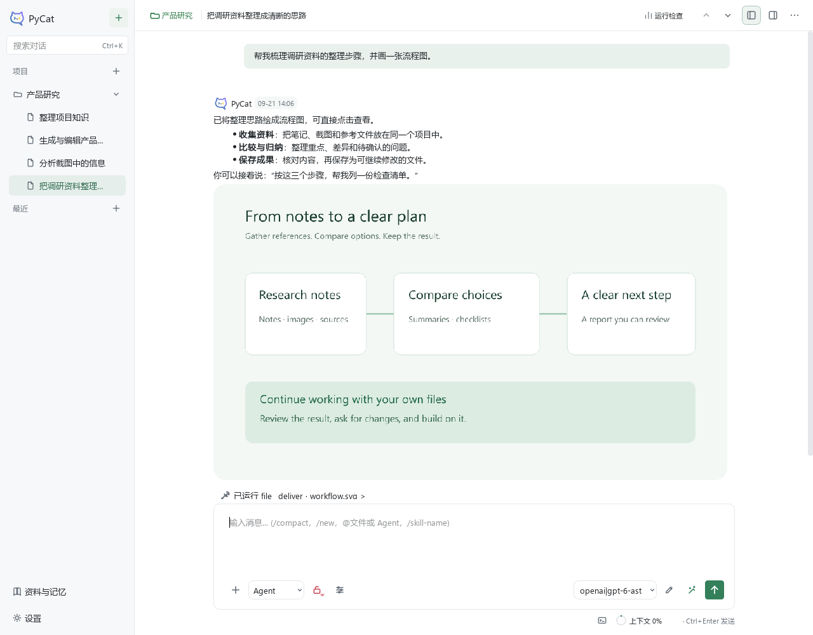
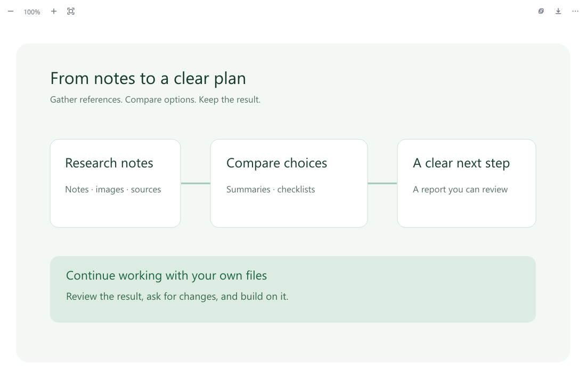

# PyCat 使用指南

[返回项目介绍](../../README.md) · [English](user-guide.md) · [查看发布版本](https://github.com/nanhuayu/pycat/releases)

这份指南从桌面操作开始。不同版本的功能可能有所差异，请同时查看所安装版本的发布说明。

## 1. 安装与连接模型

从发布页选择适合系统的文件。Windows 便携包应完整解压，保留整个 `pycat-windows-x64` 文件夹，双击其中的 **`pycat.exe`**。不要只复制一个 exe；`pycat-cli.exe` 是命令行入口，日常桌面使用不需要它。

打开 **设置 → 模型与服务**，选择你有使用权限的服务，按页面提示填写凭据并选择默认模型。连接本地模型前，需要先在电脑上部署并运行相应服务。PyCat 不附带模型额度；费用、可用模型和限制由服务商或本地部署决定。

在服务的“连接”页选择 **登录方式**：

- **ChatGPT / Codex 登录**：点击登录，在打开的浏览器中完成 ChatGPT 授权，返回 PyCat 后选择可用模型。
- **WorkBuddy / CodeBuddy（国内 · 实验性）**：使用国内账号完成浏览器授权，返回 PyCat 后选择可用模型。当前使用 CodeBuddy CLI 接口身份。
- **API Key**：填写服务地址、接口类型和服务商提供的密钥。本地服务按其实际认证要求配置。

可以通过“同步模型”查看账号返回的模型目录，并通过“退出登录”断开该账号连接。账号套餐与 API Key 的额度和权限分别由服务商管理，不能相互等同。

先发一句简短问题，确认连接能正常回复，再处理较大的文件或任务。账号登录类连接属于实验性功能，可能随上游服务变化；连接失败时可以使用服务商支持的标准接口配置。

## 2. 选择资料和操作范围

在左侧创建项目或选择项目文件夹，再新建对话。附件按钮可添加文件，也可以粘贴截图。涉及文件整理、修改或交付的任务，先确认顶部显示的是正确项目。

输入框旁的权限菜单控制自动执行和文件范围。当前桌面默认 **自动执行 + 允许所有本地路径**；如果希望逐项确认，或只处理项目中的文件，可以在这里调整。文件范围设置不等于给所有外部程序建立系统沙箱，Shell 和第三方工具仍有各自的行为。

普通问答可以使用 Chat；需要读写文件、调用工具或连续完成步骤时，选择适合任务的 Agent 模式。

## 3. 用一个小任务开始

例如，把几份公开资料放入新文件夹，再发送：

> 阅读这个项目中的资料，先整理五个主要观点，列出不确定的地方。保存为一份简报，不修改原始资料。

说明目标、允许修改的范围、期望的格式，比只说“帮我处理一下”更容易得到可检查的结果。可以在同一对话继续说“补上来源”“缩短到一页”或“根据这份结果列检查清单”。

任务执行时，可以查看运行步骤和状态。停止按钮用于中止当前运行；已经完成的文件修改或外部操作不会因此自动撤销。需要重要文件时，保留自己的备份并检查结果。

*这是使用隔离示例资料生成的实际界面截图，用于介绍布局；真实使用案例见[项目介绍](../../README.md)。*

## 4. 查看和继续使用成果

生成的图片会直接显示在对话正文中。点击图片或文件可打开预览；图片右键菜单提供复制、另存为和继续编辑。修改图片时，补充具体要求后再发送。

图片、SVG、Markdown、文本和 PDF 等有对应预览。部分 Office 文件展示提取后的内容，不等同于原办公软件的完整排版。项目中的“资料与记忆”可用于查找已有成果、整理项目资料，以及管理可复用的记忆和偏好。

*截图来自实际界面的隔离示例资料，不包含个人对话或真实服务凭据。*

## 5. 图片生成与文字识别

**生成或编辑图片**：在“模型与服务”中配置支持生图的服务和图像模型，再到 **工具与能力 → 能力** 为图像生成与编辑选择模型。聊天模型与图像模型可以不同。编辑时附加原图，或对已生成的图片选择“继续编辑图片”。

**识别图片中的文字**：在 **工具与能力 → OCR** 选择本地识别或视觉模型。视觉模型需要配置对应的模型连接；你可以调整识别提示词，例如“保留段落，对无法确认的文字标注存疑”。本地 OCR 需要安装包包含相应组件。

图片、扫描件、图表和小字的识别效果不同。关键数字、姓名和结论需要复核；模型有图片输入能力，也不等于它有图片生成能力。

## 6. 按需要添加技能和工具

打开 **设置 → 工具与能力**：

- **技能 Skills**：可复用的工作方法。查看已安装技能，按需要启用，或从市场寻找合适的来源。
- **MCP**：连接外部工具和服务的入口。安装后通常还需要配置服务、凭据或本机依赖。
- **电脑与浏览器**：配置可用后端后再使用，可能需要额外安装和系统授权。

安装前查看用途和来源。更新入口可检查支持的扩展版本；由外部工具安装的扩展可能需要通过原安装方式更新。安装技能不会自动完成所有模型、工具和权限配置。

## 7. 连接消息平台

在 **设置 → 消息通道** 添加平台、填写机器人凭据并绑定项目会话。飞书 / Lark、钉钉、Telegram、QQ 和微信提供各自的接入方式，通常需要机器人或平台账号配置。

PyCat 的电脑需要保持运行、联网并允许机器人连接。先在测试聊天中验证文字、图片和文件收发，再用于真实工作。不同接入方式支持的消息类型不同；微信公众号方式目前主要面向文字交互。

通用附件上限为单个 25 MiB、每批最多 8 个、合计 64 MiB，平台可能限制得更小。音视频作为附件传入，不代表自动转写。消息平台只回发本轮明确交付的成果，不会自动发送整个项目目录。

## 常见问题

| 情况 | 可以先做什么 |
| --- | --- |
| 切换中文或英文界面 | 在“设置 → 通用 → 外观”选择语言，保存后重启 PyCat。英文目前为预览，用户内容不会随界面语言改写。 |
| 记忆提示容量已满 | 项目记忆和用户偏好各限 8,000 字符。Memory 保留短事实与偏好，完整分析和详细项目知识保存到 Wiki；超额保存不会截断原内容。 |
| 附件导入或远程下载报路径太长 | 使用较短的项目和数据目录。Windows 的深层路径仍可能触及系统限制。 |
| 模型没有回复 | 检查服务是否可用、凭据和模型权限是否正确，查看界面给出的错误。 |
| 看不到文件或无法打开成果 | 确认项目与会话，检查文件是否仍存在、是否被修改，以及访问范围是否允许。 |
| 图片生成失败 | 确认已选择图像模型、有对应额度，尺寸和参考图片符合服务要求。 |
| 任务停在某一步 | 查看运行状态与工具结果；确认是在等待你的回答、等待程序，还是已经失败。 |
| 消息机器人没有回复 | 确认 PyCat 在线、机器人连接正常、平台权限已开通且会话绑定正确。 |

项目和会话保存在本地，但使用云端模型、联网工具或消息平台时，相关内容会发送到这些服务。根据资料性质选择适合的服务和权限。

需要帮助时，在 [Issues](https://github.com/nanhuayu/pycat/issues) 提供版本、系统、复现步骤和脱敏截图；不要附上 API Key、机器人密钥或私人文件。
